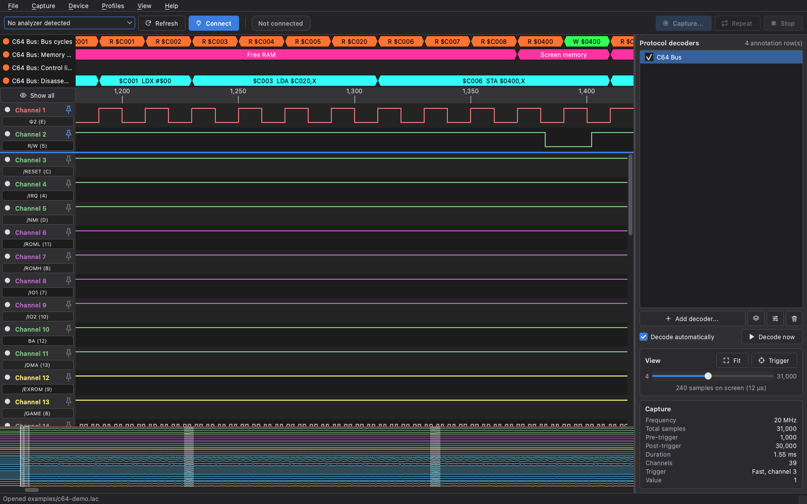

# PiPiLogicAnalyzer

For an upcoming Commodore 64 project I wanted to debug right at the 6502 bus, and a logic analyzer
is the tool for that. The C64 keeps a lot of lines busy, though: 16 address lines, 8 data lines and
a handful of control signals. Anything useful therefore starts at around 24 channels, and
affordable analyzers with that many channels are hard to come by. Luckily I came across the
[LogicAnalyzer](https://github.com/gusmanb/logicanalyzer) by Agustín Giménez Bernad (gusmanb), a
clever and inexpensive design built around Raspberry Pi Picos. It gave me exactly the hardware I
needed, so instead of starting from scratch I built on his project and extended the software and
the firmware for what I had in mind.

PiPiLogicAnalyzer is the result: software and firmware for the RP2040/RP2350 based logic analyzer,
with a cross-platform Python/Qt application for Windows, macOS and Linux and an extended firmware
for the Raspberry Pi Pico, Pico 2, Pico W, Pico 2 W, RP2040-Zero and the LogicAnalyzer Interceptor.



## Credits

This project is built on the **[LogicAnalyzer](https://github.com/gusmanb/logicanalyzer) by
Agustín Giménez Bernad (gusmanb)**. The hardware design, the capture firmware and the original
C#/Avalonia software are his work; PiPiLogicAnalyzer starts from his version 6.5 (branch
`version/v6_5`, commit `3fa3703`) and extends it. Many thanks to Agustín for creating this
remarkable open hardware logic analyzer and for sharing it under the GNU GPL, which makes a
project like this possible. If you build or use the hardware, please visit and support the
[original project](https://github.com/gusmanb/logicanalyzer).

The protocol decoders come from the [sigrok](https://sigrok.org) project
([libsigrokdecode](https://github.com/sigrokproject/libsigrokdecode)) and from the decoder set of
LogicAnalyzer 6.5. See [THIRD_PARTY_NOTICES.md](THIRD_PARTY_NOTICES.md) for all components
and licenses.

## What PiPiLogicAnalyzer adds

Compared with LogicAnalyzer 6.5:

* **Runs everywhere:** a Python/Qt application with ready-to-run builds for Windows, macOS
  (Apple Silicon and Intel) and Linux. It reads and writes the same `.lac` files and speaks to
  firmware from V6_0 on; V6_5 and newer devices automatically get the 32 channel request with up
  to 65,534 bursts.
* **Complete capture workflow:** find, connect, configure, capture, abort and repeat, over USB,
  WiFi and as a multi device set of 2 to 5 cascaded analyzers.
* **Fast display:** 1,000,000 samples × 24 channels are drawn in about 20 ms per frame (see
  [Performance](#performance)); decoders run on a worker thread.
* **Protocol decoders:** the unmodified `pd.py` decoders of libsigrokdecode run natively in
  Python, including stacked decoders, options and automatic channel assignment by name.
* **Firmware tools:** install or update the firmware from the application, board self-test,
  simulated captures generated by the board, and detailed device information.
* **Improved firmware:** many bug fixes and new commands, turbo mode off by default (see
  [firmware/README.md](firmware/README.md)).
* **Sample editor:** cut, copy, paste, delete, shift channels, regions, measurements, and
  samples created with the *Signal Description Language*.
* **Profiles** as in 6.5, plus export and import as JSON files.
* **Export** to CSV and VCD (PulseView/GTKWave) and gzip-compressed `.lac.gz` files.

The bugs fixed in the application are listed in [docs/improvements.md](docs/improvements.md),
all changes in the [changelog](CHANGELOG.md).

## Downloads

Ready-to-run builds are published under
[Releases](https://github.com/deckerjulian/PiPiLogicAnalyzer/releases). Every push to `main`
updates the pre-release
[**latest-build**](https://github.com/deckerjulian/PiPiLogicAnalyzer/releases/tag/latest-build);
tagged versions (for example `v7.0.0`) are regular releases.

| System | File | How to start |
| --- | --- | --- |
| Windows (x64) | `PiPiLogicAnalyzer-<version>-windows-x64.zip` | unzip, run `PiPiLogicAnalyzer\PiPiLogicAnalyzer.exe` |
| macOS (Apple Silicon) | `PiPiLogicAnalyzer-<version>-macos-arm64.dmg` | open, drag `PiPiLogicAnalyzer.app` to *Applications* |
| macOS (Intel) | `PiPiLogicAnalyzer-<version>-macos-x64.dmg` | as above (tagged releases only) |
| Linux (x86_64) | `PiPiLogicAnalyzer-<version>-linux-x86_64.AppImage` | `chmod +x` and run; or unpack the `.tar.gz` |
| Firmware | `LogicAnalyzer_<BOARD>[_Turbo].uf2`, all in `PiPiLogicAnalyzer-firmware-uf2.zip` | see [Installing the firmware](#installing-the-firmware) |

The applications include Python, Qt, the protocol decoders and all firmware images; nothing
else has to be installed, and *Device → Install or update firmware…* offers the images directly.
`SHA256SUMS.txt` lists the checksums, `LICENSE.txt` and `THIRD_PARTY_NOTICES.md` the licenses.

The builds are **not code-signed**:

* **Windows:** SmartScreen reports an unknown publisher → *More info* → *Run anyway*.
* **macOS:** right-click the app → *Open* on the first start, or run
  `xattr -dr com.apple.quarantine /Applications/PiPiLogicAnalyzer.app`.
* **Linux:** add your user to the `dialout` group for the serial port
  (`sudo usermod -aG dialout $USER`, then log in again). Without FUSE, start the AppImage with
  `--appimage-extract-and-run`; Qt needs `libxcb-cursor0` among others.

## Automatic builds

The workflow [`.github/workflows/build.yml`](.github/workflows/build.yml) runs on GitHub
Actions:

| Event | Tests | Firmware | Applications | Published as |
| --- | --- | --- | --- | --- |
| Pull request | ✓ | – | – | – |
| Push to `main` | ✓ | only if `firmware/` or the workflow changed, otherwise the images of *latest-build* are reused | Windows, macOS (Apple Silicon), Linux | pre-release *latest-build* |
| Tag `v*` | ✓ | ✓ | Windows, macOS (Apple Silicon and Intel), Linux | release |
| Manual run (*Actions → Build → Run workflow*) | ✓ | ✓ | all | artifacts only |

Changes to documentation alone start no run. Every packaged application is started once with
`--smoke-test` before it is uploaded.

## Creating a release

1. Set the new version in `pyproject.toml` and `pipilogicanalyzer/__init__.py`, and in
   `firmware/PiPiLogicAnalyzer/CMakeLists.txt` in `pico_set_program_version`. If the firmware
   changed in a way hosts should notice, also raise `FIRMWARE_VERSION` in the same file (it is
   the `V<major>_<minor>` the firmware reports, and every board of a multi device set has to
   carry the same one).
2. Add a section `## [<version>] - <date>` to [CHANGELOG.md](CHANGELOG.md); it becomes the
   release notes.
3. Commit and push to `main`, then tag and push the tag:

   ```bash
   git tag -a v7.0.0 -m "PiPiLogicAnalyzer 7.0.0"
   git push origin v7.0.0
   gh run watch        # optional: follow the build
   ```

The workflow checks that the tag matches both version numbers and the changelog, builds the
firmware and all applications and creates the release with all files. If the build fails,
fix the problem, delete the tag (`git push --delete origin v7.0.0` and `git tag -d v7.0.0`)
and tag again. A test build without a release: `gh workflow run build.yml`.

## Running from source

```bash
python -m venv .venv
source .venv/bin/activate          # Windows: .venv\Scripts\activate
pip install -e .
pipilogicanalyzer                      # or: python -m pipilogicanalyzer
```

Requirements: Python ≥ 3.10, PySide6-Essentials, NumPy, pyserial. On Linux, Qt additionally needs
the system libraries `libegl1 libgl1 libxkbcommon0 libfontconfig1 libdbus-1-3`.

```bash
pipilogicanalyzer capture.lac                 # open a file on start-up
pipilogicanalyzer --decoders /path/to/decoders
pipilogicanalyzer --debug-driver              # log to driver_debug.log in the settings directory
```

**macOS with iCloud Drive:** if the project lives in a synced folder ("Desktop & Documents"),
iCloud sets the `hidden` flag on the files in `.venv` (visible with `ls -lO`) and restores it
after `chflags nohidden`. Qt skips hidden plugins and would stop with *Could not find the Qt
platform plugin "cocoa"*. The application detects this and loads the plugins from a copy in
`~/Library/Caches/PiPiLogicAnalyzer/qt-plugins`. Cleaner is a virtual environment iCloud ignores,
e.g. `python -m venv .venv.nosync && ln -s .venv.nosync .venv`.

Building the packaged application yourself (on the target operating system):

```bash
python -m pip install -r requirements.txt pyinstaller pillow
python packaging/make_icons.py build/icons
python -m PyInstaller packaging/pipilogicanalyzer.spec --noconfirm   # → dist/
```

## Protocol decoders

The sigrok decoders are in the `decoders` folder and included in the packaged applications.
They are searched in this order; for decoders with the same id the first one wins:

1. paths given with `--decoders` (repeatable)
2. the environment variable `PIPILOGICANALYZER_DECODERS` (separated by `:` or `;`)
3. `./decoders` in the working directory
4. `decoders` in the project directory (next to the `pipilogicanalyzer/` package)
5. `decoders` inside the installed `pipilogicanalyzer` package (the packaged applications)
6. `<settings directory>/decoders`
7. system paths of libsigrokdecode (`/usr/share/libsigrokdecode/decoders`, PulseView on
   Windows, Homebrew on macOS)

The decoder set of LogicAnalyzer 6.5 (including `mos6502`, `mcp230xx`, `max72xx`) can be
refreshed from the original repository:

```bash
git clone --depth 1 --branch version/v6_5 https://github.com/gusmanb/logicanalyzer /tmp/la
cp -R /tmp/la/Software/decoders/. ./decoders/
```

*Help → Decoder search paths* shows the searched directories and the number of loaded decoders.

Click the name of an annotation row (or double-click an annotation) to open the row as a list in a
window of its own, e.g. to read the disassembly of the C64 bus decoder. The list shows sample, time
relative to the trigger, duration, type and value; it can be filtered and copied (*Copy values*
gives a plain listing). Selecting an entry shows it in the waveform, and hovering an annotation in
the waveform selects its entry.

### C64 bus decoder

`c64bus` decodes the 6510 bus cycles of a Commodore 64 captured at the expansion port (profile
`examples/c64-expansion-port-profile.json`): reads and writes with address and data, the memory
region, control lines and a disassembly of the executed code.

* **Read point:** the 6510 takes the data at the falling edge of Φ2. The decoder reads address,
  data and R/W at the last sample before that edge (option *Read the bus*, plus *Read offset* in
  samples). Cycles whose lines change one sample before or after the read point are marked
  `(unstable: A5 A9)` and listed in the *Warnings* row: the capture is too coarse there, record at
  a higher sampling rate or take Φ2 from the same board as the bus.
* **Disassembly:** the 6510 has no SYNC output, so the decoder follows the program flow. It
  synchronises on a RESET/IRQ/NMI vector fetch or on three consistent instructions in a row,
  checks the operand reads, follows branches, jumps, `JSR`/`RTS`/`RTI` and interrupt sequences and
  synchronises again when a prediction fails. Undocumented opcodes are shown as such. Cycles taken
  by the VIC (BA low) are skipped.
* In PulseView the decoder reads at the edge, because libsigrokdecode cannot look back one sample.

### Triggering a multi device set

Connect the trigger output of one board to the trigger input of the others (Pico: GPIO 0 → GPIO 1).
On every board both pins are linked, so the trigger pins of all boards form one line. The board of
the trigger channel evaluates the trigger and starts the other boards through this line:

* **Pattern:** on any board, up to 16 channels (5 with fast matching) on consecutive trigger inputs
  of that board, e.g. channels 1–21 or 22–24 of a Pico board. Firmware that does not report its
  groups (older than version 7.1) allows channels 1–16. A pattern cannot span two boards.
* **Edge on a channel:** on every board whose firmware drives the trigger output on an edge (the
  firmware of this project); the capture dialog only lists these channels.
* **External trigger (every board):** the trigger signal goes to the trigger input of every board
  and each board waits for the edge itself, so all boards start together without a trigger delay.
  The trigger input is a 3.3 V GPIO: use a level shifter or a voltage divider for 5 V signals.

Blast mode and bursts are not available for a set, and the board evaluating the trigger has to
capture at least one channel.

### Aligning the boards of a multi device set

The other boards are triggered through the trigger line. The driver compensates the fixed delay of
the trigger, but a slave can still start a sample early or late, and the crystals of the boards
drift apart by a few samples over a full buffer. After every multi device capture, and with
*Capture → Align boards* for captures opened from files, the application corrects this:

* **Reference line (exact):** connect one signal of a slave board also to a free input of the
  master and name it like the slave channel plus ` ref`. The C64 profile uses `A0 (Y) ref` on CH15
  of board B for A0 of board A. Offset and drift are measured from both copies.
* **Clock (estimate):** without a usable reference line, the offset is estimated from a clock
  channel on the master (`Φ2`, `PHI2`, `CLK` or `clock`): address lines of a synchronous bus only
  change after the falling clock edge, so the slave is moved by the smallest amount that removes
  changes from the two samples before the edges.

After a capture the reference line is used when it is available. The status bar and the row
*Alignment* in the capture information name the method and the correction, e.g.
`board 2 moved by -1 samples (reference A0 (Y) ref)`. *Capture → Align boards* measures again on
the samples as captured; when several methods are possible, it lets you choose one of them or
leave a board unchanged.

## Profiles

A profile stores capture settings (channels with names and colours, frequency, samples,
trigger, bursts) together with the decoder configuration. All profiles are kept in
`<settings directory>/profiles.json`.

* **Menu *Profiles*:** *Save current settings as profile…* stores the loaded capture (or the
  last used capture settings) with the decoders. Every profile has *Load*, *Edit…* (name, notes,
  capture settings and decoders) and *Delete*.
  Loading applies the decoders immediately; the capture settings apply to the next capture.
  *Export profiles…* / *Import profiles…* exchange all profiles as a JSON file.
* **Capture dialog, button *Profiles*:** save the current settings as a profile, export them
  to a file, import them from a file, or apply a stored profile.

Profile files of this application, single capture settings and the `profiles.json` of the
original 6.5 software (including its decoder tree) can be imported.

## Testing the board

Neither test needs connected signals.

* ***Device → Board self-test…*** checks the connected board: capture buffer, trigger link,
  every channel input using the internal pull resistors, and a real capture through PIO/DMA in
  normal and blast mode. Requires the firmware of this project, see
  [firmware/README.md](firmware/README.md#self-test-and-simulation).
* ***Capture → Simulated capture…*** records test signals: a counter, a walking bit, or UART,
  SPI and I2C carrying the text "PiPiLogicAnalyzer". With this firmware the board generates the
  signals and transfers them like a real capture, which tests the firmware, USB/WiFi and the
  application. Without a board, or with the original firmware, the application computes the same
  signals. For the protocol pattern the matching UART, SPI and I2C decoders are added on request.

## Installing the firmware

While no analyzer is connected, the application looks for Raspberry Pi boards without the
PiPiLogicAnalyzer firmware every two seconds: boards in bootloader mode (drive `RPI-RP2` or
`RP2350`) or running other firmware such as MicroPython. A banner with *Install firmware…*
appears when one is found. For a connected analyzer with an older or the original firmware the
banner offers *Update firmware…*.

*Device → Install or update firmware…*:

1. Select the board. The list shows the installed firmware version and Pico model of every
   analyzer. If the board is not in bootloader mode, *Restart into bootloader* restarts it;
   alternatively hold BOOTSEL while plugging it in.
2. Select the image. The list shows the images built with `firmware/build_all.sh` in
   `firmware/uf2/` (the packaged applications include all images) with the board and the firmware
   version they contain, e.g. *Raspberry Pi Pico 2 - 7.1 PiPiLogicAnalyzer_BOARD_PICO_2.uf2*, so the
   version can be compared with the one installed on the board. *Browse…* accepts any other `.uf2`
   file. Images for a different chip (RP2040/RP2350) cannot be flashed.
3. *Flash firmware* copies the image to the drive. As soon as the analyzer appears as a serial
   port, it is selected in the device list.

*Device → Device information…* shows what is known about the connected device and can be
copied with *Copy to clipboard*:

* board, build setting, firmware version and microcontroller;
* with the firmware of this project also chip revision, boot ROM, unique board ID, flash size,
  Pico SDK version, build date, system clock, turbo mode and WiFi;
* the USB data of the port: VID:PID, manufacturer, product, serial number;
* the capture limits.

## Example without hardware

The repository contains a synthetic capture (I2C, UART, clock):

```bash
pipilogicanalyzer examples/demo.lac
```

Then press *Add decoder…* on the right, add `I2C` (SCL → channel 1, SDA → channel 2) and
stack for example `eeprom24xx` on top. `python tools/make_demo_capture.py` recreates the file.

`examples/c64-demo.lac` shows a Commodore 64 captured at the expansion port with the profile
`c64-expansion-port-profile.json`: a reset, a loop writing "C64!!" to the screen and changing the
border colour, and two IRQs. Load the profile (*Profiles → C64 expansion port … → Load*) to get
the decoders, or add the `C64 bus` decoder yourself; its *Disassembly* row shows the program.
`python tools/make_c64_demo.py` recreates the file with a cycle-accurate 6510 model.

## Controls

| Action | Input |
| --- | --- |
| Zoom | mouse wheel over the waveform, ruler or annotations (`Shift`: bigger steps), `+` / `-` (also with `Ctrl`), pinch on a trackpad, `Ctrl` `0` (fit) |
| Channel height (more channels on the screen) | `Alt` + mouse wheel over the waveform or the channel names, `Ctrl` `Shift` `↑` / `↓`, `Ctrl` `Shift` `0` (default), slider *Channel height* in the *View* box; low channels show their name instead of the name field |
| Scroll horizontally | swipe left/right on a trackpad, `←` `→` (10 %), drag the waveform, `Ctrl` + mouse wheel, horizontal wheel, scroll bar |
| Scroll through the channels | swipe up/down on a trackpad, scroll bar |
| Go to trigger | `Ctrl` `T` |
| Page/step | `Ctrl` `↑` `↓` (full page), `Shift` `←` `→` (one sample) |
| Start / repeat / stop capture | `F5` / `Ctrl` `R` / `Shift` `F5` |
| Set/remove marker | click into the ruler |
| Select a range | drag in the ruler (`Shift` + click extends the selection) |
| Sample menu | right-click in the ruler (copy, paste, delete, measure, region …) |
| See how a decoded value is made up | rest the pointer on an annotation: its samples are marked across all channels, a dashed line shows where the decoder read the value, and every channel it read shows its level (`A15 = 1 (+$8000)`); buses such as A0…A15 also show their value (`A = $FFFC`), and lines changing next to the read point are marked with `~` |
| Show/hide a channel | dot left of the channel name |
| Pin a channel | pin right of the channel name: pinned channels stay at the top while the others scroll (*View → Unpin all channels*) |
| Change a channel colour | click the channel name |
| Move the overview | click or drag in the preview at the bottom |

*Help → Keyboard shortcuts* lists all shortcuts.

## File formats

| Format | Read | Write | Remarks |
| --- | --- | --- | --- |
| `.lac` | ✓ | ✓ | identical to the original software, including regions |
| `.lac` (≤ V5) | ✓ | – | packed `UInt128` samples are unpacked |
| `.lac.gz` | ✓ | ✓ | same structure, gzip-compressed |
| `.csv` | – | ✓ | optionally with a time column relative to the trigger |
| `.vcd` | – | ✓ | for PulseView, GTKWave, … |

## Project structure

```
pipilogicanalyzer/
├── driver/      device drivers: protocol, serial/network, multi device, detection
├── core/        analysis (transition index, measurements), files, colours, settings, firmware
├── sdl/         Signal Description Language (samples created by hand)
├── sigrok/      sigrokdecode compatible runtime, decoder search and execution
└── ui/          Qt interface: main window, widgets, dialogs, theme, icons
decoders/        sigrok protocol decoders (libsigrokdecode, LogicAnalyzer 6.5, c64bus)
firmware/        firmware for Pico/Pico 2/Pico W/Zero/Interceptor (C, Pico SDK)
packaging/       PyInstaller build, icons, AppImage
tests/           pytest suite (driver, analysis, files, SDL, decoders, GUI, packaging)
```

## Performance

Measured with 1,000,000 samples on 24 channels (offscreen, 1600 × 1000):

| Operation | Time |
| --- | --- |
| load a capture, index it and create the overview | 118 ms |
| redraw with 100 visible samples | 3.7 ms |
| redraw with 10,000 visible samples | 20 ms |
| redraw with 1,000,000 visible samples | 20 ms |

The cost per frame depends on the pixel width of the window, not on the number of samples.
Details are in [docs/improvements.md](docs/improvements.md).

## Tests

```bash
pip install -e ".[dev]"
QT_QPA_PLATFORM=offscreen pytest
```

## Status and contributing

PiPiLogicAnalyzer is a young project. The application is covered by an automated test suite and
built for Windows, macOS and Linux; the firmware is built for every supported board, but not every
board has been tried with real signals yet. Reports of what works on your board, and what does
not, are very welcome.

Bug reports, ideas and pull requests are welcome, see [CONTRIBUTING.md](CONTRIBUTING.md). For
questions about building the hardware itself, the
[original project](https://github.com/gusmanb/logicanalyzer) is the best place to ask.

## Disclaimer

This is a hobby project. It is not affiliated with, endorsed by or supported by Raspberry Pi Ltd
or by Agustín Giménez Bernad (gusmanb), whose LogicAnalyzer it builds on. "Raspberry Pi" and
"Pico" are trademarks of Raspberry Pi Ltd.

Use it at your own risk, and keep an eye on your hardware:

* The inputs of the boards tolerate **3.3 V**. Higher voltages — 5 V systems such as a Commodore 64
  included — need a level shifter or a divider, on the trigger input as well.
* The *Turbo* firmware images overclock the board to 400 MHz with raised core voltage. That is
  outside the specification of the RP2040/RP2350 and can shorten its life.
* Protocol decoders are Python files that are executed. Only add decoders from sources you trust.

As stated in sections 15 to 17 of the GNU General Public License, the software comes without any
warranty, and nobody is liable for damage arising from its use.

## License

PiPiLogicAnalyzer is licensed under the **GNU General Public License v3** ([LICENSE](LICENSE)),
the license of the original LogicAnalyzer by Agustín Giménez Bernad. It is a modified and
extended version of his work; the changes are described in the [changelog](CHANGELOG.md),
[docs/improvements.md](docs/improvements.md) and [firmware/README.md](firmware/README.md).

The protocol decoders keep their own licenses (mostly GPL-2.0-or-later or GPL-3.0-or-later, a few
MIT or BSD, stated in each file; all GPL-compatible). The packaged applications and firmware images contain further open source
components such as Qt for Python (LGPL-3.0) and the Raspberry Pi Pico SDK (BSD-3-Clause); see
[THIRD_PARTY_NOTICES.md](THIRD_PARTY_NOTICES.md).
