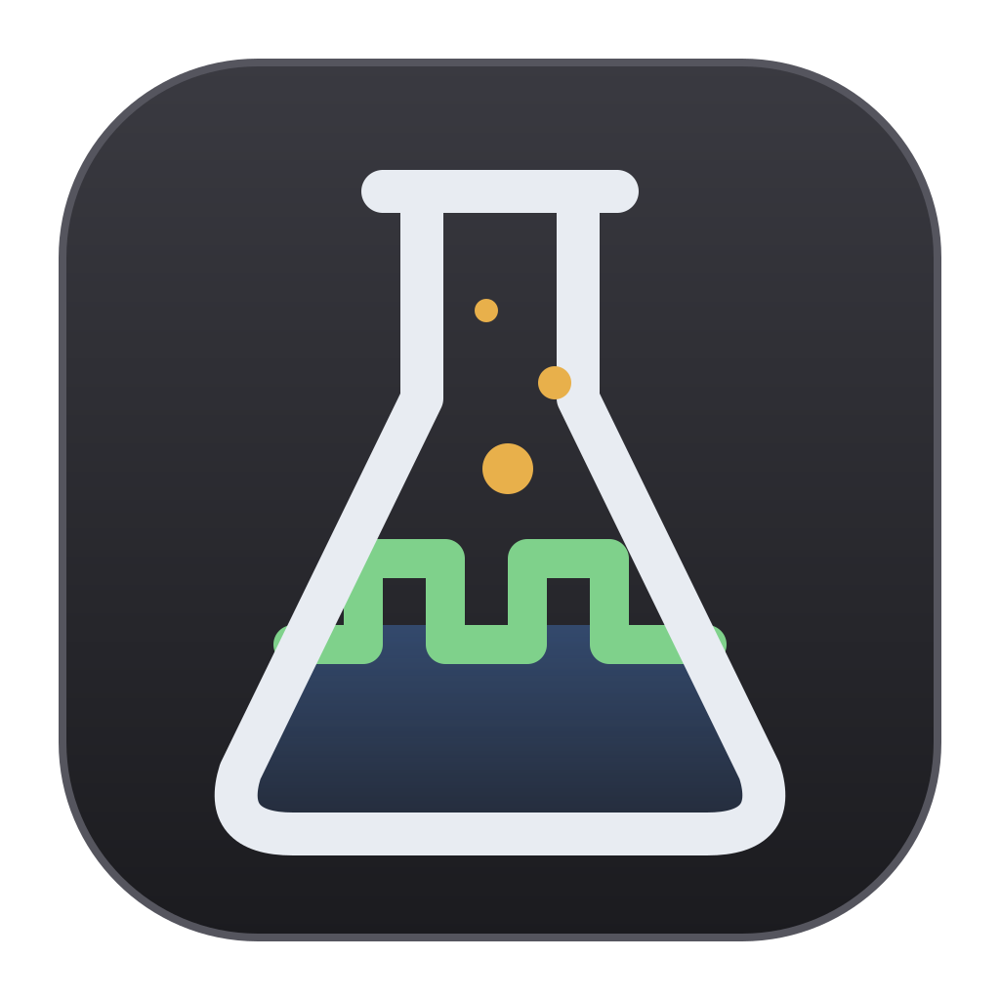
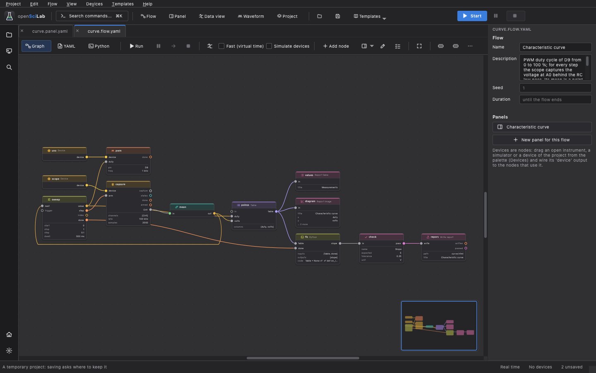
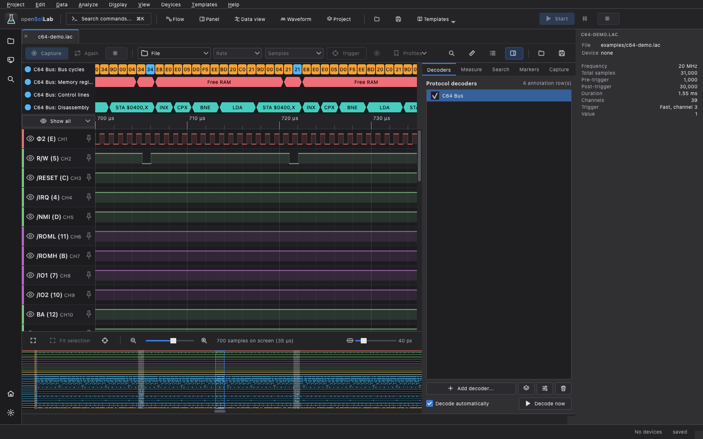
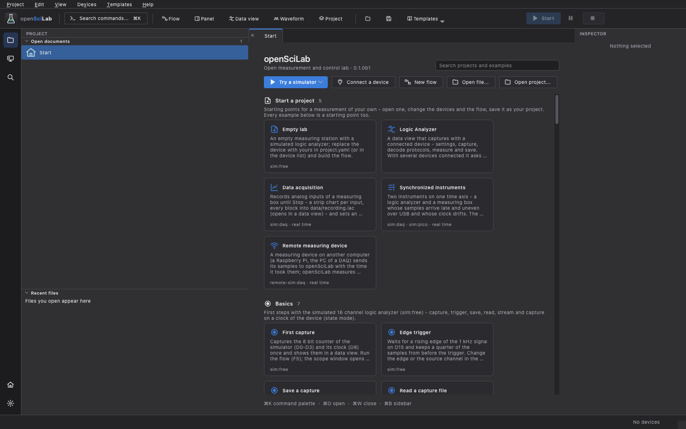

# openSciLab

**openSciLab** is an open measurement and control lab for the desk: connect several instruments
at once, capture, process, check and generate signals in **flows** – drawn in an editor or written
in Python –, operate them from **panels**, write **reports**, and try all of it with **simulated
instruments** before any hardware is connected. It grew out of *PiPiLogicAnalyzer*, a logic
analyzer for Raspberry Pi Pico boards; the logic analyzer is still there, complete, as the *data
view* of the lab. Windows, macOS and Linux; GPL-3.0.

> **Beta (0.1).** The application is covered by about 2000 automated tests and every function
> works with the simulators. Much of the new firmware (Pico protocol 8, the Arduino firmware, the
> Rigol bridge) has **not been checked on real hardware yet**. Reports of what works on your
> hardware, and what does not, are very welcome.



## What it does

* **Instruments side by side.** Pico boards, Arduino boards, DreamSourceLab DSLogic analyzers, a
  Rigol DHO900 oscilloscope, measuring devices on other computers and simulators – each with a
  device card for its pins, signals, timing and details. What openSciLab offers follows from what
  a device reports it can do.
* **Flows.** Nodes for devices, GPIO, generators, every sigrok protocol decoder, measurements,
  signal processing, control (timers, sweeps, sequences, state machines, Python), data, views and
  reports, wired in a visual editor. A flow is a `*.flow.yaml` file (also written in Python) and
  runs in real time or in a deterministic virtual time.
* **Panels** with switches, sliders, numbers, LEDs, charts and scopes bound to a flow – a measuring
  station of your own, also full screen.
* **The logic analyzer** (*data view*): captures with triggers and trigger sequences, streams,
  analog channels and state captures, sigrok decoders, cursors, measurements, search, buses,
  comparison with a reference, sample editing – and a C64/6502 bus decoder with disassembly.
* **Signal generation**: waveforms, arbitrary points, digital patterns, UART/SPI/I²C frames, and
  captures played back on an output.
* **Time**: samples of different instruments on one time axis – sync signals, latency
  measurement, clock drift, NTP/PTP.
* **Reports** in HTML or PDF with passed and failed checks; `openscilab run --report` makes a flow a
  test on the command line.
* **Simulators** that behave like the real devices – with their limits, wiring, faults and USB
  timing – and can be told what to simulate: a UART, SPI, I²C, a counter, the C64 bus, a capture
  file.



## Supported devices

| Device | Connection | What openSciLab does with it | State |
| --- | --- | --- | --- |
| Raspberry Pi Pico, Pico 2, Pico W, Pico 2 W, RP2040-Zero, LogicAnalyzer Interceptor | USB, WiFi; openSciLab Pico firmware | 24 channel logic analyzer (100 MHz, 200 MHz with *Turbo*), streams, trigger sequences, state mode, 2–5 boards as one analyzer; GPIO, PWM, pulses, ADC, monitor, pattern generator, UART/SPI/I²C | version 8 not yet tried on hardware (the 7.x capture firmware it extends is in use) |
| Arduino Uno, Nano, Mega 2560, Uno R4 Minima, ESP32, ESP32-S3 | USB; openSciLab Arduino firmware | logic analyzer of its pins (buffer, stream, state), analog inputs, GPIO, PWM, monitor, pattern/square/arbitrary generator, UART/SPI/I²C | not yet tested on hardware |
| DreamSourceLab DSLogic Plus, U2Pro16, U3Pro16, U3Pro32 | USB; DSView firmware | logic analyzer up to 1 GHz, streams, record to disk | experimental, tested on a U2Pro16 |
| Rigol DHO900 (DHO924S ...) | network: SCPI, or the bridge app on the instrument | 4 analog and 16 logic channels, large captures arriving progressively, generator | not yet tested on the instrument |
| Measuring devices on other computers | network; Python package `openscilab_device` | values, streams, outputs and commands with their time | beta |
| Simulators (`sim:free`, `sim:uno`, `sim:uno_r4`, `sim:pico`, `sim:daq`, `sim:dho924s`, `remote-sim:…`) | built in | everything above, several at once, wired together | ready |

New devices are added as drivers or as plugins that need no change of openSciLab, see
[docs/drivers.md](docs/drivers.md).

## Getting started

### Download

Ready-to-run builds are under [Releases](https://github.com/deckerjulian/openSciLab/releases); every
push to `main` also updates the pre-release
[*latest-build*](https://github.com/deckerjulian/openSciLab/releases/tag/latest-build).

| System | File | How to start |
| --- | --- | --- |
| Windows (x64) | `openSciLab-<version>-windows-x64.zip` | unzip, run `openSciLab\openSciLab.exe` |
| macOS (Apple Silicon) | `openSciLab-<version>-macos-arm64.dmg` | open, drag `openSciLab.app` to *Applications* |
| macOS (Intel) | `openSciLab-<version>-macos-x64.dmg` | as above (tagged releases only) |
| Linux (x86_64) | `openSciLab-<version>-linux-x86_64.AppImage` | `chmod +x` and run; or unpack the `.tar.gz` |
| Firmware | `openSciLab-firmware-pico-uf2.zip`, `openSciLab-firmware-arduino.zip`, `openSciLab-bridge.apk` | installed from the application, see [Firmware](https://github.com/deckerjulian/openSciLab/wiki/Firmware) |

The applications include Python, Qt, the protocol decoders and the Pico firmware images. They are **not
code-signed**: on Windows choose *More info → Run anyway*, on macOS right-click → *Open* on the
first start (or `xattr -dr com.apple.quarantine /Applications/openSciLab.app`), on Linux add
yourself to the `dialout` group for serial ports. Details in the wiki under
[Installation](https://github.com/deckerjulian/openSciLab/wiki/Installation).

### First steps



openSciLab opens on the start page. *Try a simulator* connects a simulated Arduino, Pico or
oscilloscope, *Connect a device* lists the boards on USB and in the network, and below them every
example project is a tile – each opens as a temporary project to start from, and all of them run
with simulators. *Start a project* holds the plain starting points: an empty lab, the logic
analyzer, data acquisition, synchronized instruments and a remote measuring device. The
[wiki](https://github.com/deckerjulian/openSciLab/wiki/Getting-started) walks through a first
measurement.

### From source

```bash
python -m venv .venv
source .venv/bin/activate          # Windows: .venv\Scripts\activate
pip install -e .
openscilab                         # the application (also: python -m openscilab)
openscilab run examples/flows/counter.flow.yaml --fast   # a flow without the window
openscilab-cli --help              # captures, decoding and conversion on the command line
```

Python ≥ 3.10; on Linux Qt needs `libegl1 libgl1 libxkbcommon0 libfontconfig1 libdbus-1-3`.

## Documentation

* **The [wiki](https://github.com/deckerjulian/openSciLab/wiki)** is the user guide: installation,
  getting started, devices and firmware, the data view, protocol decoders, flows and nodes, panels
  and reports, time and synchronization, simulators, remote devices, scripting, troubleshooting.
* Reference in this repository:
  [docs/lab.md](docs/lab.md) (flows, every node, panels, reports),
  [docs/cli.md](docs/cli.md) (command line and Python API),
  [docs/simulator.md](docs/simulator.md) (simulators and their profiles),
  [docs/timing.md](docs/timing.md) (the time of samples),
  [docs/remote.md](docs/remote.md) (remote devices and their protocol),
  [docs/drivers.md](docs/drivers.md) (new devices),
  [docs/protocols.md](docs/protocols.md) (capabilities and the protocols of the firmware),
  [firmware/README.md](firmware/README.md) (building and the Pico firmware),
  [docs/improvements.md](docs/improvements.md) (what the logic analyzer fixes compared with the
  original software), [CHANGELOG.md](CHANGELOG.md).

## Development

```bash
pip install -e ".[dev]"
QT_QPA_PLATFORM=offscreen pytest   # about 2000 tests, a few minutes
ruff check openscilab tests
```

```
openscilab/
├── core/        signals, analysis, files, timing, firmware handling (no Qt)
├── driver/      devices: pico/, arduino/, dslogic/, rigoldho/, remote/, simulated/, process/ (devices in a process of their own)
├── lab/         flows: model, engine, nodes/, projects, panels, reports, examples (no Qt)
├── sigrok/      sigrokdecode compatible runtime for the protocol decoders
├── sdl/         Signal Description Language
├── ui/          Qt interface: shell, documents (data view, flow, panel, device card ...), widgets
├── api.py, cli.py   Python API and command line
openscilab_device/   the package for measuring devices on other computers
decoders/        sigrok protocol decoders (libsigrokdecode, LogicAnalyzer 6.5) and c64bus
examples/        example library (library/), simulator profiles (sim/), captures, profiles, plugins
firmware/        Pico firmware (C), Arduino firmware (PlatformIO), bridge app (Android)
packaging/       PyInstaller build, icons, AppImage
tests/           pytest suite
```

### Builds and releases

[`.github/workflows/build.yml`](.github/workflows/build.yml) runs on GitHub Actions:

| Event | Tests | Firmware | Applications | Published as |
| --- | --- | --- | --- | --- |
| Pull request | ✓ | – | – | – |
| Push to `main` | ✓ | when `firmware/` changed, else reused | Windows, macOS (Apple Silicon), Linux | pre-release *latest-build* |
| Tag `v*` | ✓ | ✓ | Windows, macOS (Apple Silicon and Intel), Linux | release (pre-release for `a`, `b`, `rc` versions) |
| Manual run | ✓ | ✓ | all | artifacts only |

A release:

1. Set the version (`0.1.0b1`, `0.2.0`, ...) in `pyproject.toml`, `openscilab/__init__.py`,
   `pico_set_program_version` in `firmware/pico/CMakeLists.txt` and `FIRMWARE_VERSION` in
   `firmware/arduino/src/board.h`. The Pico's `FIRMWARE_VERSION` (`V8_0`) and the protocol versions
   name what the application must know; raise them only when the protocol changes
   ([docs/protocols.md](docs/protocols.md)).
2. Rename `## [Unreleased]` in [CHANGELOG.md](CHANGELOG.md) to `## [<version>] - <date>`; it becomes
   the release notes.
3. Push to `main`, then tag: `git tag -a v<version> -m "openSciLab <version>"` and
   `git push origin v<version>`. The workflow checks that tag, versions and changelog agree.

## Credits

openSciLab is built on the **[LogicAnalyzer](https://github.com/gusmanb/logicanalyzer) by Agustín
Giménez Bernad (gusmanb)**: the Pico logic analyzer hardware, its capture firmware and the original
C#/Avalonia software are his work, and this project started from his version 6.5. Many thanks to
Agustín for sharing it under the GNU GPL – if you build the hardware, please visit and support the
original project. The protocol decoders come from [sigrok](https://sigrok.org)
([libsigrokdecode](https://github.com/sigrokproject/libsigrokdecode)) and the decoder set of
LogicAnalyzer 6.5; the DSLogic driver follows [DSView](https://github.com/DreamSourceLab/DSView).
See [THIRD_PARTY_NOTICES.md](THIRD_PARTY_NOTICES.md) for all components and licenses.

## Contributing

Bug reports, test results from real hardware, ideas and pull requests are welcome, see
[CONTRIBUTING.md](CONTRIBUTING.md); security problems go to [SECURITY.md](SECURITY.md).

## Disclaimer

This is a hobby project. It is not affiliated with, endorsed by or supported by Raspberry Pi Ltd,
Arduino, DreamSourceLab, RIGOL or Agustín Giménez Bernad (gusmanb). "Raspberry Pi" and "Pico" are
trademarks of Raspberry Pi Ltd, "Arduino" of Arduino SA, "DSLogic" and "DSView" of DreamSourceLab,
"RIGOL" of RIGOL Technologies.

Use it at your own risk, and keep an eye on your hardware:

* The inputs of the Pico boards tolerate **3.3 V**. Higher voltages – 5 V systems such as a
  Commodore 64 included – need a level shifter or a divider, on the trigger input as well.
* Flows and panels switch real outputs: check what a flow drives before you run it on hardware.
  The *All outputs safe* button of a device card and the watchdog of the firmware release them.
* The *Turbo* Pico firmware overclocks the board to 400 MHz with raised core voltage, outside the
  specification of the RP2040/RP2350.
* Protocol decoders, driver plugins and `control.python` nodes are Python code that is executed:
  only use those from sources you trust.

As stated in sections 15 to 17 of the GNU General Public License, the software comes without any
warranty, and nobody is liable for damage arising from its use.

## License

openSciLab is licensed under the **GNU General Public License v3** ([LICENSE](LICENSE)), the license
of the original LogicAnalyzer by Agustín Giménez Bernad, whose work it modifies and extends. The
protocol decoders keep their own licenses (mostly GPL-2.0-or-later or GPL-3.0-or-later, a few MIT
or BSD, all GPL-compatible). The packaged applications and firmware images contain further open
source components such as Qt for Python (LGPL-3.0) and the Raspberry Pi Pico SDK (BSD-3-Clause);
see [THIRD_PARTY_NOTICES.md](THIRD_PARTY_NOTICES.md).
